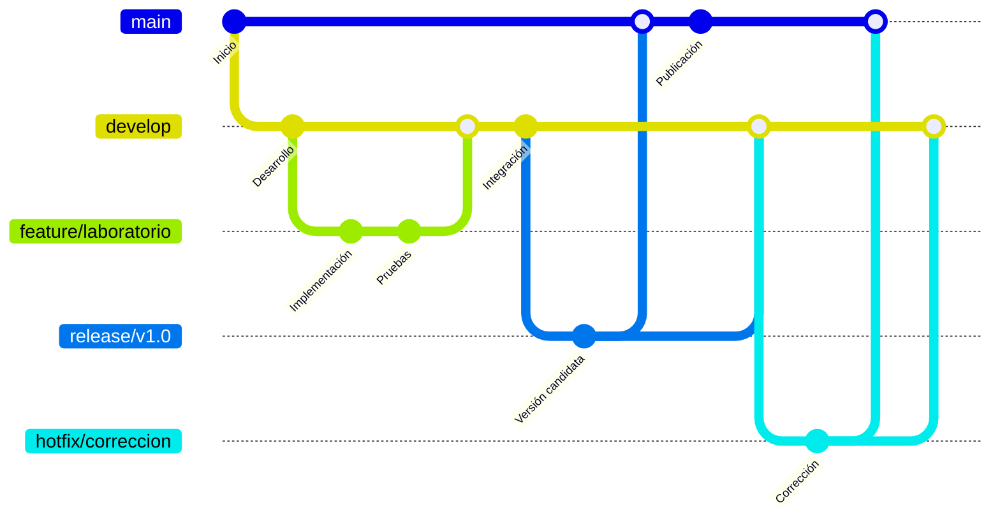

# 🚀 Laboratorios de GitFlow

<p align="center">
Aprende GitFlow mediante laboratorios prácticos orientados al desarrollo profesional con Git.
</p>

<p align="center">


</p>

---

# 📖 Descripción

Bienvenido a este repositorio.

Todos los laboratorios desarrollados en este proyecto utilizarán **GitFlow** como estrategia de control de versiones. El objetivo es que cada práctica siga un flujo de trabajo organizado, facilitando el desarrollo de nuevas funcionalidades, la integración de cambios y el mantenimiento del código mediante una metodología ampliamente utilizada en entornos profesionales.

---

# 🌿 Flujo de trabajo

Los laboratorios seguirán la siguiente estrategia basada en **GitFlow**:



---

# 📚 ¿Qué aprenderás?

A lo largo de los diferentes laboratorios pondrás en práctica:

* Creación de repositorios Git.
* Gestión de ramas mediante GitFlow.
* Desarrollo de funcionalidades en ramas **feature**.
* Integración de cambios en **develop**.
* Preparación de versiones mediante **release**.
* Corrección de errores críticos utilizando **hotfix**.
* Buenas prácticas para el trabajo colaborativo.

---

# 📂 Organización del repositorio

```text
Repositorio
├── gitflow_sqlite
├── gitflow_mlops
└── README.md
```

Cada laboratorio está diseñado para reforzar el uso de **GitFlow** mediante ejercicios prácticos y escenarios similares a los que se presentan en proyectos de desarrollo reales.

---

# 🎯 Objetivo

Aplicar de manera progresiva el flujo de trabajo **GitFlow**, comprendiendo el propósito de cada tipo de rama y su integración dentro de un proceso ordenado de desarrollo de software.

---

## 👨‍💻 Autor

**Edison Naranjo**

Curso de **DevOps**
